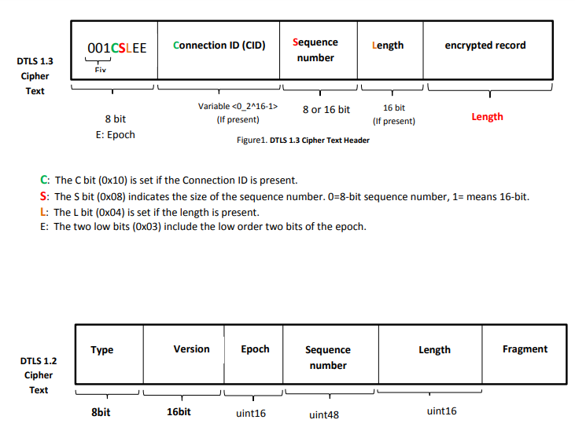
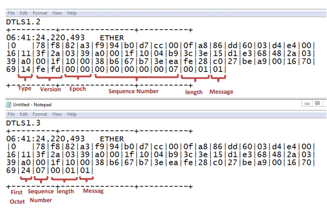

# Convert Dtls1.2 to Dtls1.3
 Convert Dtls1.2 to Dtls1.3 header

 <h3 >1.1 DTLS1.2</h1>
 
   <hp style="font-size:30px;">
The basic design philosophy of DTLS is to construct "TLS over datagram transport". The purpose of DTLS is to
make only the minimal changes to TLS required to fix this problem. To the greatest extent possible, DTLS is
identical to TLS. Unlike TLS, DTLS is resilient in the face of invalid records (e.g., invalid formatting, length, MAC,
etc.). In general, invalid records SHOULD be silently discarded. 

 <h3 >1.2 DTLS1.3</h3>
DTLS 1.3 allows client/server applications to communicate over the Internet in a way that is designed to
prevent eavesdropping, tampering, and message forgery. The DTLS 1.3 protocol is intentionally based on the
Transport Layer Security (TLS) 1.3 protocol and provides equivalent security guarantees with the exception of
order protection/non-replay ability. Datagram semantics of the underlying transport are preserved by the
DTLS protocol.
 <h5 >DTLS1.2 and 1.3 has a same structure of DTLSPlaintext. But different from DTLSCiphertext</h5>
  
struct {  
   ContentType type;  
   ProtocolVersion legacy_record_version; 
   uint16 epoch = 0 
   uint48 sequence_number; 
   uint16 length; 
   opaque fragment[DTLSPlaintext.length]; 
 } DTLSPlaintext; 
 
<h3> 1.3 Difference of DTLS 1.2 and DTLS 1.3 </h3>

The DTLS 1.3 record layer is different from the DTLS 1.2 record layer. The main differences are as follows: 

The DTLS 1.3 record layer is different from the DTLS 1.2 record layer. 
 1. The DTLSCiphertext structure omits the version and type fields. 
 2. The DTLSCiphertext structure has a variable length header. 
 3. The number of bits used for the epoch and sequence number fields in the DTLSCiphertext structure have
been reduced from DTLS1.2 versions. 

 

 <h3>Results</h3>

 
